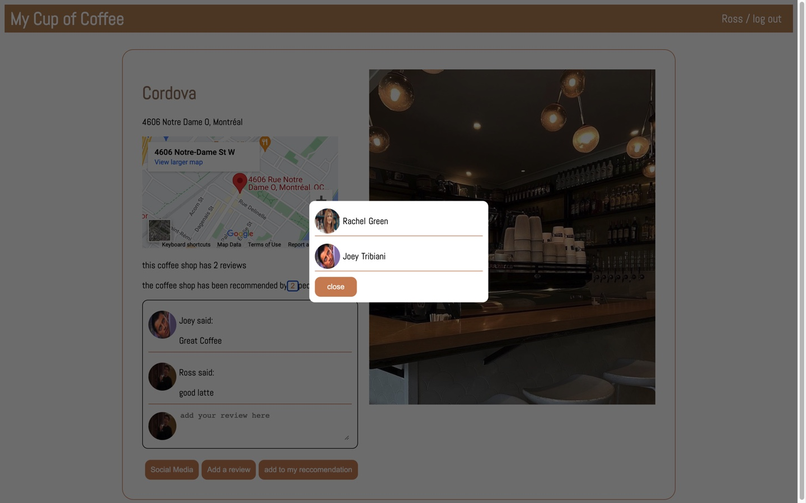

# My Cup of Coffee

My Cup of Coffee is a social media platform where users can discover new coffee shop in Montreal through their friends reccomendation.

## Screen shot

## Technologies

- React Frontend (creat-react-app)
- Node/Express API
- MongoDB
- Google Map Generator (Maps Embed) https://developers.google.com/maps/documentation/embed/get-started

## Features

- user can create a new account or log into an excisting account
- user can see all the coffee shop in the website
- user can add a review
- user can add and remove a coffeeshop from their reccomended list
- user can follow and unfollow another user
- user can see what the people he follows as reccomended.

## Local Development

To run the frontend:

- `cd client`
- `yarn install`
- `yarn start`

To run the backend (server):

- `cd server`
- `yarn install`
- `yarn start`
